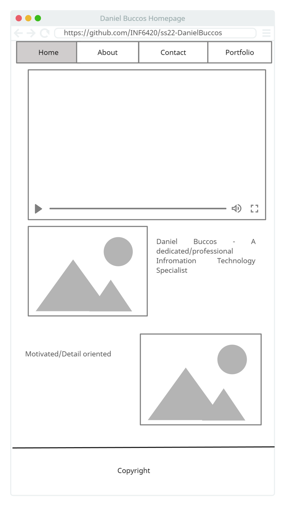
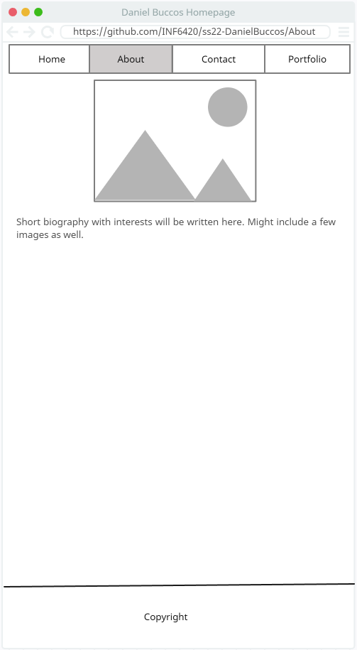
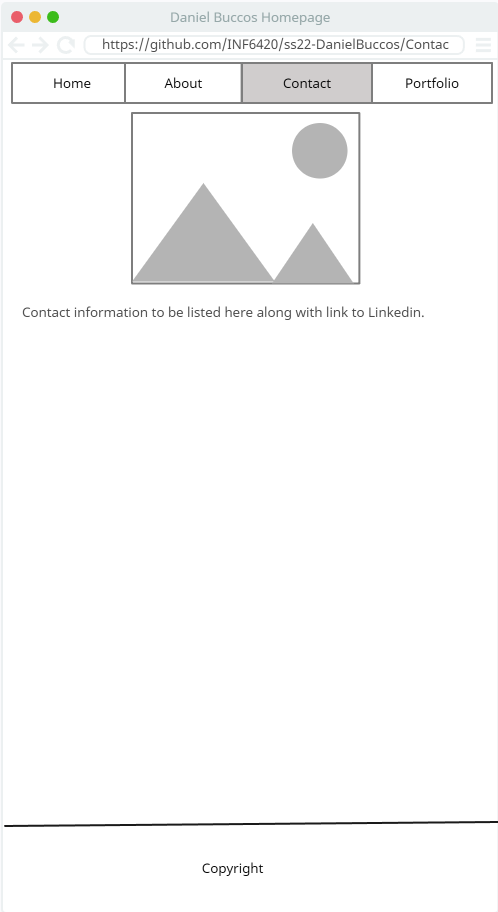
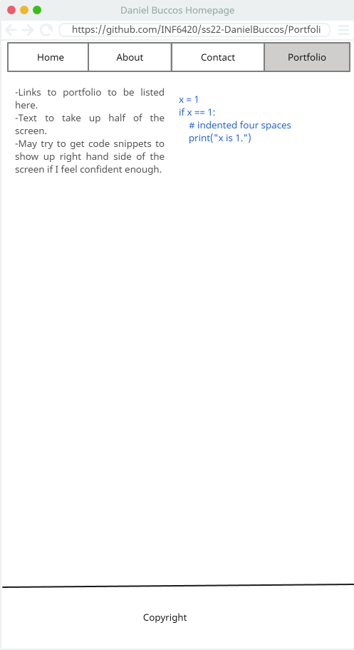

# Daniel Buccos' INF65420 Project

A portfolio site showcasing my work.

## Wireframes

I value planning so here are some wireframes to show how the site architercture and layout could possibly look.

Header -will include navigation menu.

Navigation Menu - will include links to other pages: Home, About, contact, portfolio.

Main Content - Will include a few images, brief description of myself, and highlight skillset.

Footer - Will include copyright information.

Header -will include navigation menu.

Navigation Menu - will include links to other pages: Home, About, Contact, Portfolio.

Main Content - Will include a few more images, a more detailed biography of myself, and details about a few of my hobbies/volunteer interests.

Footer - Will include copyright information.

Header -will include navigation menu.

Navigation Menu - will include links to other pages: Home, About, Contact, Portfolio.

Main Content - Will include contact details for me, a link to my LinkedIn page, GitHub page, and a professional photograph.

Footer - Will include copyright information.

Header -will include navigation menu.

Navigation Menu - will include links to other pages: Home, About, Contact, Portfolio.

Main Content - Links to some of the work I can share, some of my writing, and some of the code I have written. May try to get fancy and see if I can script it so that code/writing will appear on the right when a link is clicked.

Footer - Will include copyright information.